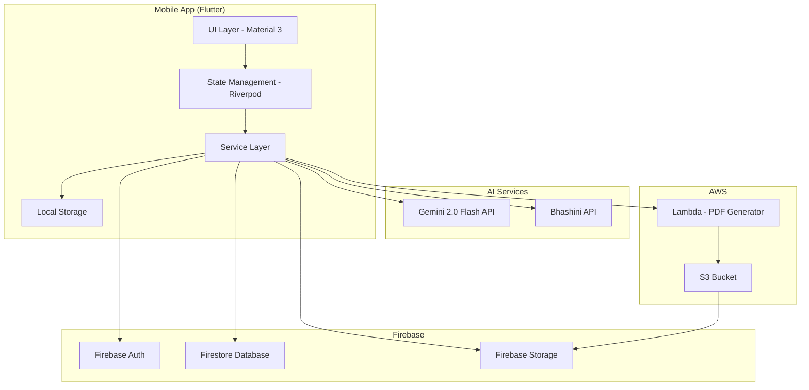

# Design Document: Vani-Sahayak

## Overview

Vani-Sahayak is a multilingual AI-powered mobile application that enables users to fill physical forms using voice input in Indian languages. The system architecture follows a client-server model with Flutter mobile frontend, Firebase backend services, and AWS Lambda for heavy PDF processing. The design emphasizes modularity, offline-first capabilities where possible, and seamless integration with AI services (Gemini 2.0 Flash and Bhashini API).

### Key Design Principles

1. **Modularity**: Clear separation between UI, business logic, and data layers
2. **Offline-First**: Local state management with background sync to Firebase
3. **Responsive AI**: Streaming responses from AI services for better UX
4. **Error Resilience**: Graceful degradation and retry mechanisms for all external services
5. **Accessibility**: Voice-first design with visual feedback for all interactions

## Architecture

### High-Level Architecture



### Layer Responsibilities

**UI Layer (Presentation)**
- Material 3 widgets with Indian Flag color theme
- Screen navigation and routing
- User input capture (voice, camera, touch)
- Visual feedback and animations
- Error display and user notifications

**State Management Layer (Riverpod)**
- Application state (auth, session, form data)
- Provider definitions for all features
- State persistence coordination
- Reactive updates to UI

**Service Layer (Business Logic)**
- API client implementations (Gemini, Bhashini, Firebase, AWS)
- Form scanning orchestration
- Conversation flow management
- PDF generation coordination
- Data validation and transformation

**Data Layer**
- Local storage (Hive/SharedPreferences)
- Firebase Firestore models
- Data serialization/deserialization
- Offline queue management

## Components and Interfaces

### 1. Authentication Module

**Purpose**: Manage user authentication and session lifecycle

**Components**:
- `AuthService`: Firebase Auth wrapper
- `AuthStateProvider`: Riverpod provider for auth state
- `LoginScreen`: UI for authentication

**Key Interfaces**:

```dart
abstract class AuthService {
  Future<User?> signInWithGoogle();
  Future<User?> signInWithPhone(String phoneNumber);
  Future<void> signOut();
  Stream<User?> get authStateChanges;
  User? get currentUser;
}
```

### 2. Voice Interface Module

**Purpose**: Handle speech-to-text and text-to-speech using Bhashini API

**Components**:
- `BhashiniService`: API client for Bhashini
- `VoiceController`: Manages recording and playback
- `LanguageProvider`: Stores user language preference

**Key Interfaces**:

```dart
abstract class BhashiniService {
  Future<String> speechToText(AudioData audio, String languageCode);
  Future<AudioData> textToSpeech(String text, String languageCode);
  List<Language> getSupportedLanguages();
}

class AudioData {
  final Uint8List bytes;
  final int sampleRate;
  final AudioFormat format;
}

class Language {
  final String code;        // e.g., "hi", "ta", "bn"
  final String name;        // e.g., "Hindi", "Tamil"
  final String nativeName;  // e.g., "हिन्दी", "தமிழ்"
}
```

### 3. Form Scanner Module

**Purpose**: Capture form images and extract field information using Gemini Vision

**Components**:
- `CameraService`: Camera access and image capture
- `GeminiVisionService`: Gemini 2.0 Flash Vision API client
- `FormParser`: Converts Gemini response to structured data

**Key Interfaces**:

```dart
abstract class GeminiVisionService {
  Future<FormStructure> analyzeForm(ImageData image);
}

class ImageData {
  final Uint8List bytes;
  final int width;
  final int height;
}

class FormStructure {
  final String formId;
  final List<FormField> fields;
  final ImageData originalImage;
  final DateTime scannedAt;
}

class FormField {
  final String id;
  final String label;
  final FieldType type;
  final Rect coordinates;  // Position on form
  final bool isRequired;
  final String? hint;
}

enum FieldType {
  text,
  number,
  date,
  email,
  phone,
  checkbox,
  signature
}
```

### 4. Conversation Engine Module

**Purpose**: Generate contextual questions and manage conversation flow

**Components**:
- `GeminiConversationService`: Gemini 2.0 Flash API client for conversation
- `ConversationController`: Manages conversation state and flow
- `ValidationService`: Validates user responses

**Key Interfaces**:

```dart
abstract class GeminiConversationService {
  Future<Question> generateQuestion(
    FormField field,
    String languageCode,
    Map<String, dynamic> context
  );
  
  Future<ValidationResult> validateResponse(
    FormField field,
    String response,
    String languageCode
  );
}

class Question {
  final String text;
  final String fieldId;
  final List<String>? suggestions;
}

class ValidationResult {
  final bool isValid;
  final dynamic parsedValue;
  final String? errorMessage;
  final String? clarificationQuestion;
}

class ConversationState {
  final String sessionId;
  final FormStructure form;
  final Map<String, dynamic> filledData;
  final int currentFieldIndex;
  final ConversationStatus status;
}

enum ConversationStatus {
  notStarted,
  inProgress,
  awaitingConfirmation,
  completed
}
```

### 5. PDF Generator Module

**Purpose**: Generate filled PDFs using AWS Lambda and PyMuPDF

**Components**:
- `LambdaService`: AWS Lambda client
- `PDFService`: Coordinates PDF generation flow

**Key Interfaces**:

```dart
abstract class LambdaService {
  Future<PDFResult> generatePDF(PDFRequest request);
}

class PDFRequest {
  final String sessionId;
  final ImageData formImage;
  final Map<String, FieldData> fieldData;
}

class FieldData {
  final String value;
  final Rect coordinates;
  final FieldType type;
}

class PDFResult {
  final String pdfUrl;
  final String storageRef;
  final int fileSizeBytes;
}
```

**Lambda Function (Python)**:

```python
def lambda_handler(event, context):
    """
    Receives form image and field data, generates filled PDF
    """
    # Extract request data
    form_image_base64 = event['formImage']
    field_data = event['fieldData']
    session_id = event['sessionId']
    
    # Convert image to PDF
    pdf_doc = create_pdf_from_image(form_image_base64)
    
    # Overlay text on PDF
    for field_id, field in field_data.items():
        overlay_text(
            pdf_doc,
            text=field['value'],
            coordinates=field['coordinates'],
            field_type=field['type']
        )
    
    # Save to S3
    pdf_bytes = pdf_doc.write()
    s3_key = f"filled-forms/{session_id}.pdf"
    upload_to_s3(pdf_bytes, s3_key)
    
    # Return download URL
    return {
        'pdfUrl': generate_presigned_url(s3_key),
        'storageRef': s3_key,
        'fileSizeBytes': len(pdf_bytes)
    }
```

### 6. Session Management Module

**Purpose**: Manage form-filling sessions and data persistence

**Components**:
- `SessionService`: CRUD operations for sessions
- `SessionProvider`: Riverpod provider for current session
- `SyncService`: Background sync with Firestore

**Key Interfaces**:

```dart
abstract class SessionService {
  Future<Session> createSession(FormStructure form);
  Future<void> updateSession(Session session);
  Future<Session?> getSession(String sessionId);
  Future<List<Session>> getUserSessions();
  Future<void> deleteSession(String sessionId);
}

class Session {
  final String id;
  final String userId;
  final FormStructure form;
  final Map<String, dynamic> filledData;
  final SessionStatus status;
  final DateTime createdAt;
  final DateTime? completedAt;
  final String? pdfUrl;
}

enum SessionStatus {
  scanning,
  filling,
  generating,
  completed,
  failed
}
```

### 7. UI Components

**Key Screens**:

1. **HomeScreen**: Language selection, new form, history
2. **ScanScreen**: Camera view with guidance overlay
3. **ConversationScreen**: Voice interaction UI with waveform animation
4. **ReviewScreen**: Summary of filled data with edit options
5. **PDFViewScreen**: PDF preview with download/share actions
6. **HistoryScreen**: List of completed forms

**Shared Widgets**:

```dart
class VoiceButton extends StatefulWidget {
  final VoidCallback onPressed;
  final bool isListening;
  final bool isProcessing;
}

class FormFieldCard extends StatelessWidget {
  final FormField field;
  final String? value;
  final VoidCallback onEdit;
}

class LanguageSelector extends StatelessWidget {
  final List<Language> languages;
  final Language? selected;
  final ValueChanged<Language> onChanged;
}

class ThemeConstants {
  static const saffron = Color(0xFFFF9933);
  static const white = Color(0xFFFFFFFF);
  static const green = Color(0xFF128807);
  static const navyBlue = Color(0xFF000080);
}
```

## Data Models

### Firestore Schema

**users** collection:
```json
{
  "userId": "string",
  "email": "string",
  "phoneNumber": "string",
  "preferredLanguage": "string",
  "createdAt": "timestamp",
  "lastActiveAt": "timestamp"
}
```

**sessions** collection:
```json
{
  "sessionId": "string",
  "userId": "string",
  "formStructure": {
    "formId": "string",
    "fields": [
      {
        "id": "string",
        "label": "string",
        "type": "string",
        "coordinates": {"x": 0, "y": 0, "width": 0, "height": 0},
        "isRequired": true,
        "hint": "string"
      }
    ],
    "imageUrl": "string"
  },
  "filledData": {
    "fieldId": "value"
  },
  "status": "string",
  "createdAt": "timestamp",
  "completedAt": "timestamp",
  "pdfUrl": "string"
}
```

**form_templates** collection (optional, for common forms):
```json
{
  "templateId": "string",
  "name": "string",
  "category": "string",
  "formStructure": {},
  "usageCount": 0
}
```

### Local Storage Schema

**Hive Boxes**:

1. **auth_box**: User credentials and tokens
2. **session_box**: Current session state for offline access
3. **settings_box**: App preferences and language selection
4. **queue_box**: Pending operations for background sync

## Correctness Properties


*A property is a characteristic or behavior that should hold true across all valid executions of a system—essentially, a formal statement about what the system should do. Properties serve as the bridge between human-readable specifications and machine-verifiable correctness guarantees.*

### Property 1: Session State Round-Trip Persistence

*For any* session state, saving the state (either by closing the app or backgrounding it), then restoring the app should produce an equivalent session state with all form data, conversation progress, and metadata intact.

**Validates: Requirements 1.4, 1.5, 8.4, 8.5**

### Property 2: Authentication Creates Session

*For any* successful authentication attempt, a user session record should be created in Firebase with the correct user ID and timestamp.

**Validates: Requirements 1.2**

### Property 3: Form Scanning Creates Session Record

*For any* form that is scanned and processed, a session record should be created in Firestore containing the form structure, timestamp, and session ID.

**Validates: Requirements 1.3**

### Property 4: Voice Interface Language Consistency

*For any* selected language and any voice interaction (TTS or ASR), the Voice_Interface should use the selected language code for all Bhashini API calls.

**Validates: Requirements 2.2, 2.3**

### Property 5: Speech Recognition Error Handling

*For any* failed or unclear ASR result, the Voice_Interface should request the user to repeat their response rather than proceeding with invalid data.

**Validates: Requirements 2.4**

### Property 6: Language Switching Continuity

*For any* active session and any language change request, the system should continue the conversation in the new language without losing session state or filled data.

**Validates: Requirements 2.5**

### Property 7: Form Image Transmission

*For any* captured form image, the Form_Scanner should send the image data to Gemini 2.0 Flash Vision API with proper encoding and metadata.

**Validates: Requirements 3.2**

### Property 8: Field Extraction Completeness

*For any* Gemini Vision API response, the extracted FormStructure should contain field labels, field types, coordinates, and required/optional status for all identified fields.

**Validates: Requirements 3.3**

### Property 9: Multi-Page Form Merging

*For any* multi-page form, scanning additional pages should merge the field data such that all fields from all pages are present in the final FormStructure without duplicates.

**Validates: Requirements 3.6**

### Property 10: Form Data Persistence

*For any* extracted form field data or user-provided field value, the data should be stored in Firestore linked to the correct session ID.

**Validates: Requirements 3.4, 4.5**

### Property 11: Question Generation Completeness

*For any* set of extracted form fields, the Conversation_Engine should generate at least one question for each required field.

**Validates: Requirements 4.1**

### Property 12: Question Vocalization

*For any* generated question, the Conversation_Engine should use the Voice_Interface to speak the question in the user's selected language.

**Validates: Requirements 4.2**

### Property 13: Response Validation by Field Type

*For any* user response and form field, the Conversation_Engine should validate the response against the field's type (date, number, text, etc.) and return a validation result.

**Validates: Requirements 4.3, 5.1, 5.2, 5.3**

### Property 14: Invalid Response Clarification

*For any* invalid or unclear user response, the Conversation_Engine should generate and ask a clarifying question rather than accepting the invalid data.

**Validates: Requirements 4.4, 5.4**

### Property 15: Field Edit Capability

*For any* previously filled field and any edit request, the Conversation_Engine should allow editing, update the stored value in Firestore, and reflect the change in the session state.

**Validates: Requirements 4.7**

### Property 16: Required Field Non-Empty Validation

*For any* required form field, empty or whitespace-only inputs should be rejected with an appropriate error message.

**Validates: Requirements 5.3**

### Property 17: Offline Operation Queueing

*For any* operation attempted while network connectivity is lost, the operation should be queued locally and automatically retried when connection is restored.

**Validates: Requirements 5.5**

### Property 18: PDF Generation Pipeline

*For any* confirmed form data, the complete pipeline (send to Lambda → overlay text → upload to Storage → return URL) should execute successfully and return a valid download URL.

**Validates: Requirements 6.1, 6.2, 6.3, 6.4**

### Property 19: PDF Text Overlay Accuracy

*For any* field data with coordinates, the PDF_Generator should overlay the text at the specified coordinates with correct positioning and formatting.

**Validates: Requirements 6.2**

### Property 20: PDF Download Persistence

*For any* PDF download request, the file should be saved to device storage and be accessible after the app is closed and reopened.

**Validates: Requirements 6.6**

### Property 21: Loading Indicator Display

*For any* AI API request (Gemini or Bhashini), a loading indicator should be displayed in the UI while the request is in progress.

**Validates: Requirements 7.7**

### Property 22: State Change Propagation

*For any* change to user data, the Riverpod providers should update and all listening widgets should be notified and re-rendered.

**Validates: Requirements 8.2**

### Property 23: Critical Data Immediate Persistence

*For any* critical data modification (session creation, field value update, form completion), the change should be persisted to Firestore immediately without waiting for batch operations.

**Validates: Requirements 8.3**

### Property 24: API Authentication Headers

*For any* API call to Gemini, Bhashini, or AWS Lambda, the request should include proper authentication headers and credentials.

**Validates: Requirements 9.1, 9.2, 9.3**

### Property 25: API Retry with Exponential Backoff

*For any* failed API request, the system should retry the request with exponential backoff up to a maximum number of attempts before reporting failure.

**Validates: Requirements 9.2**

### Property 26: API Response Validation

*For any* API response received, the system should validate the response structure matches the expected schema before processing the data.

**Validates: Requirements 9.5**

### Property 27: Failed API Error Display

*For any* API call that fails after all retry attempts, a user-friendly error message should be displayed with an option to retry manually.

**Validates: Requirements 9.4**

### Property 28: Form Completion Metadata Storage

*For any* completed form session, the session metadata (including completion timestamp, form ID, and PDF URL) should be saved to Firestore.

**Validates: Requirements 10.1**

### Property 29: Historical Form Access

*For any* selected historical form from the history list, the system should display the form details and provide access to the generated PDF.

**Validates: Requirements 10.3**

### Property 30: Form Deletion Completeness

*For any* form deletion request, both the session data in Firestore and the PDF file in Firebase Storage should be removed.

**Validates: Requirements 10.4**

### Property 31: Form History Sorting

*For any* list of historical forms, the forms should be sorted by completion timestamp in descending order (most recent first).

**Validates: Requirements 10.5**

## Error Handling

### Error Categories

**1. Network Errors**
- Connection timeout
- No internet connectivity
- API rate limiting
- Server unavailable

**Strategy**:
- Implement exponential backoff retry mechanism
- Queue operations for offline execution
- Display clear error messages with retry options
- Cache responses where appropriate

**2. AI Service Errors**
- Gemini API failures
- Bhashini API failures
- Invalid or unexpected responses
- Rate limit exceeded

**Strategy**:
- Validate all API responses before processing
- Implement fallback mechanisms (e.g., manual field entry if vision fails)
- Log errors for debugging
- Provide user-friendly error explanations

**3. Data Validation Errors**
- Invalid date formats
- Non-numeric input for number fields
- Empty required fields
- Malformed data

**Strategy**:
- Validate all user inputs before storage
- Provide immediate feedback with specific error messages
- Suggest corrections (e.g., "Please enter date as DD/MM/YYYY")
- Allow users to retry without losing other filled data

**4. Permission Errors**
- Camera access denied
- Storage access denied
- Microphone access denied

**Strategy**:
- Request permissions with clear explanations
- Provide instructions to enable permissions in settings
- Gracefully degrade functionality if permissions denied
- Show helpful error messages

**5. PDF Generation Errors**
- Lambda timeout
- Invalid image format
- Insufficient coordinates
- Storage upload failure

**Strategy**:
- Implement timeout handling with user notification
- Validate image format before sending to Lambda
- Retry failed uploads automatically
- Provide option to regenerate PDF

### Error Recovery Flows

```dart
class ErrorHandler {
  static Future<T> withRetry<T>({
    required Future<T> Function() operation,
    int maxAttempts = 3,
    Duration initialDelay = const Duration(seconds: 1),
  }) async {
    int attempt = 0;
    Duration delay = initialDelay;
    
    while (attempt < maxAttempts) {
      try {
        return await operation();
      } catch (e) {
        attempt++;
        if (attempt >= maxAttempts) rethrow;
        
        await Future.delayed(delay);
        delay *= 2; // Exponential backoff
      }
    }
    
    throw Exception('Max retry attempts exceeded');
  }
  
  static String getUserFriendlyMessage(Exception error, String languageCode) {
    // Map technical errors to user-friendly messages in user's language
    if (error is NetworkException) {
      return getLocalizedString('error.network', languageCode);
    } else if (error is ValidationException) {
      return getLocalizedString('error.validation', languageCode);
    }
    // ... more error types
    return getLocalizedString('error.generic', languageCode);
  }
}
```

## Testing Strategy

### Dual Testing Approach

The testing strategy employs both unit tests and property-based tests to ensure comprehensive coverage:

**Unit Tests**: Focus on specific examples, edge cases, and integration points
- Authentication flows with specific credentials
- UI widget rendering with specific data
- Error handling for specific error types
- Integration between components

**Property-Based Tests**: Verify universal properties across all inputs
- Session state persistence across random states
- Data validation across random inputs
- API integration across random payloads
- Form processing across random form structures

Both approaches are complementary and necessary for comprehensive correctness validation.

### Property-Based Testing Configuration

**Framework**: Use `faker` package for Flutter to generate random test data

**Configuration**:
- Minimum 100 iterations per property test
- Each test tagged with feature name and property number
- Tag format: `@Tags(['vani-sahayak', 'property-N'])`

**Example Property Test Structure**:

```dart
@Tags(['vani-sahayak', 'property-1'])
test('Property 1: Session State Round-Trip Persistence', () async {
  // Feature: vani-sahayak, Property 1: Session state round-trip
  
  for (int i = 0; i < 100; i++) {
    // Generate random session state
    final sessionState = generateRandomSessionState();
    
    // Save state
    await sessionService.saveState(sessionState);
    
    // Simulate app close/reopen
    await sessionService.clearMemory();
    
    // Restore state
    final restoredState = await sessionService.restoreState(sessionState.id);
    
    // Verify equivalence
    expect(restoredState, equals(sessionState));
  }
});
```

### Unit Test Coverage

**Authentication Module**:
- Test Google sign-in flow
- Test phone authentication flow
- Test sign-out behavior
- Test auth state persistence

**Voice Interface Module**:
- Test TTS with sample text in multiple languages
- Test ASR with sample audio files
- Test error handling for API failures
- Test language switching

**Form Scanner Module**:
- Test camera initialization
- Test image capture and encoding
- Test Gemini API integration with sample forms
- Test field extraction parsing

**Conversation Engine Module**:
- Test question generation for different field types
- Test response validation for various inputs
- Test conversation flow state transitions
- Test edit functionality

**PDF Generator Module**:
- Test Lambda invocation
- Test PDF overlay with sample data
- Test Firebase Storage upload
- Test error handling for Lambda timeouts

**Session Management Module**:
- Test session CRUD operations
- Test Firestore sync
- Test offline queue management

### Integration Tests

- End-to-end form filling flow
- Camera → Vision → Conversation → PDF pipeline
- Offline mode with sync on reconnection
- Multi-page form scanning and merging

### Test Data Generation

```dart
class TestDataGenerator {
  static FormStructure generateRandomForm() {
    final faker = Faker();
    final fieldCount = faker.randomGenerator.integer(10, min: 3);
    
    return FormStructure(
      formId: faker.guid.guid(),
      fields: List.generate(fieldCount, (i) => generateRandomField()),
      originalImage: generateRandomImage(),
      scannedAt: faker.date.dateTime(),
    );
  }
  
  static FormField generateRandomField() {
    final faker = Faker();
    return FormField(
      id: faker.guid.guid(),
      label: faker.lorem.words(3).join(' '),
      type: faker.randomGenerator.element(FieldType.values),
      coordinates: generateRandomRect(),
      isRequired: faker.randomGenerator.boolean(),
      hint: faker.lorem.sentence(),
    );
  }
  
  // ... more generators
}
```

### Performance Testing

- Measure form scanning time (target: < 5 seconds)
- Measure PDF generation time (target: < 10 seconds)
- Measure voice response latency (target: < 2 seconds)
- Test with large forms (50+ fields)
- Test with high-resolution images

### Accessibility Testing

- Test voice interface with various accents
- Test with different speech speeds
- Test error recovery flows
- Test with screen readers (for visual feedback)

### Security Testing

- Test Firebase security rules
- Test API key protection
- Test data encryption in transit
- Test user data isolation
